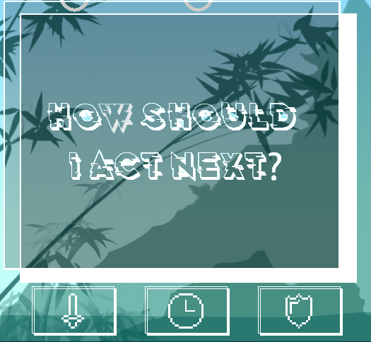
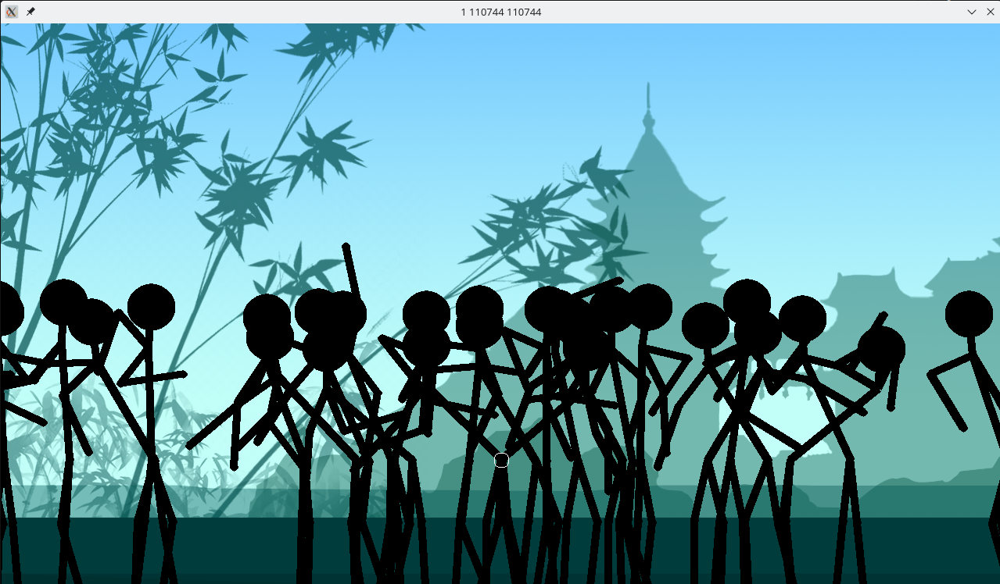
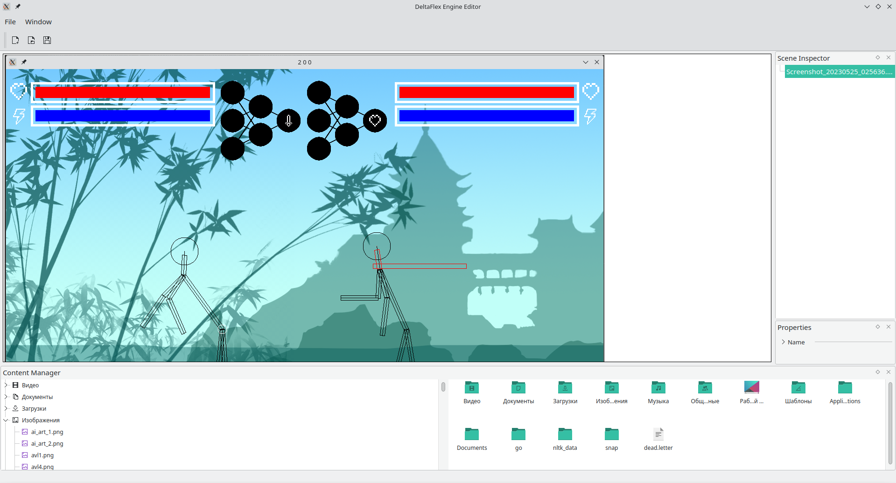

## Идея проекта
Проект представляет собой инновационную игровую платформу, которая использует нейросети для моделирования поведения стикманов в боевых сценариях. Степень сложности и оригинальности заключается в том, что игроки могут наблюдать за боями двух стикманов, управляемых различными нейронными моделями, и при этом участвовать в процессе обучения этих моделей.

## Пример взаимодействия

## Обучение при помощи эволюции

## Движок для создания сцен

